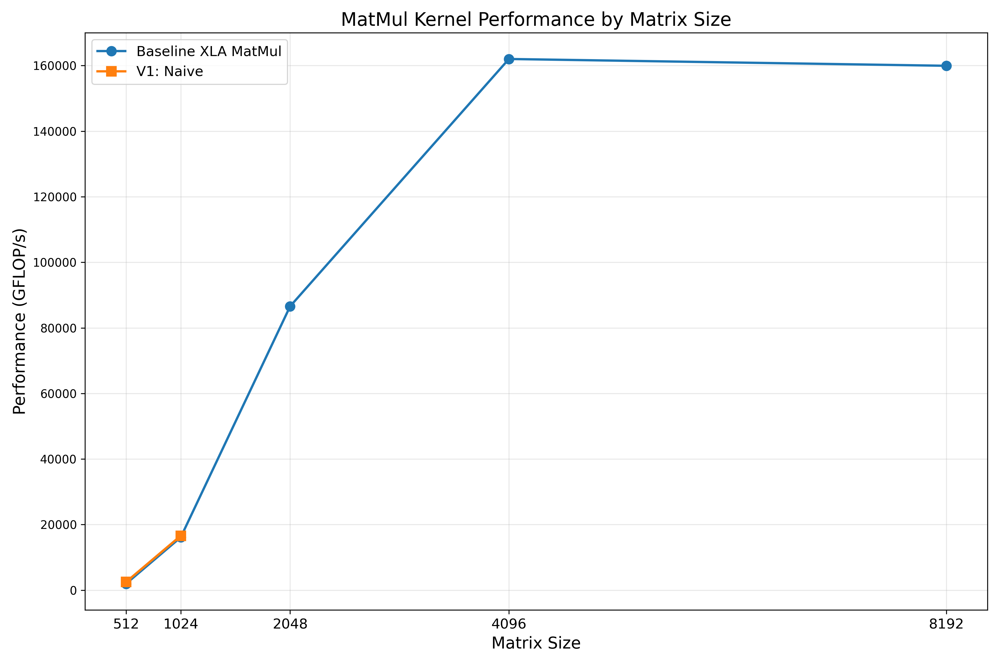
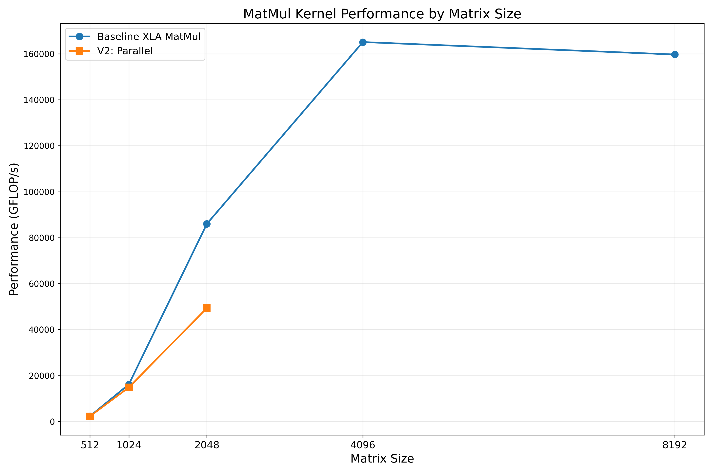
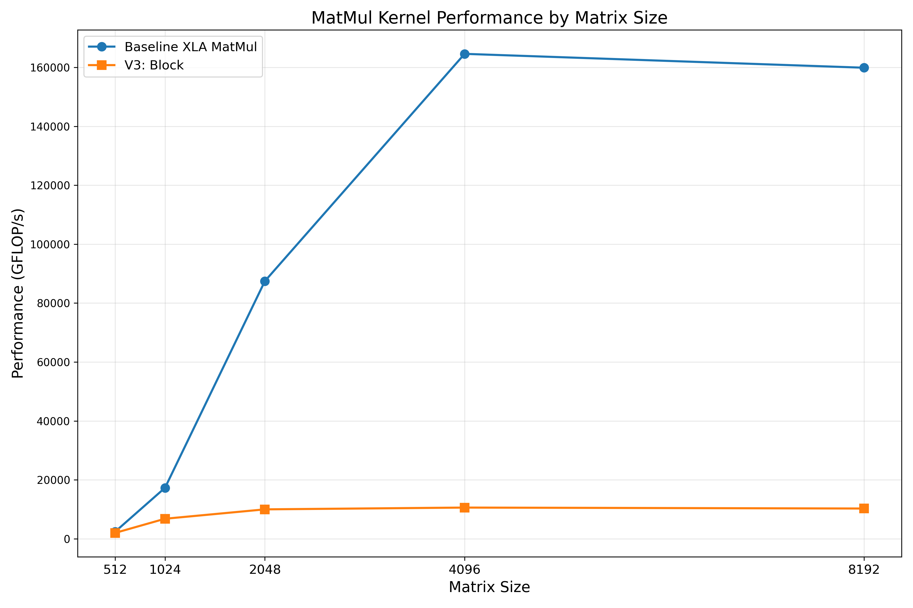
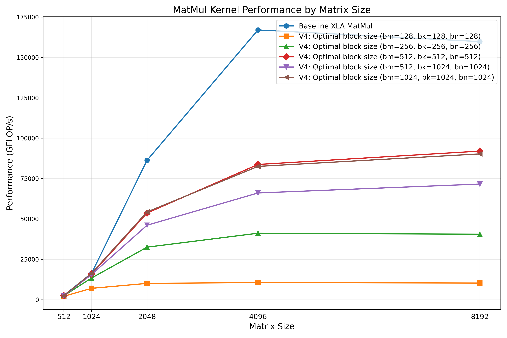
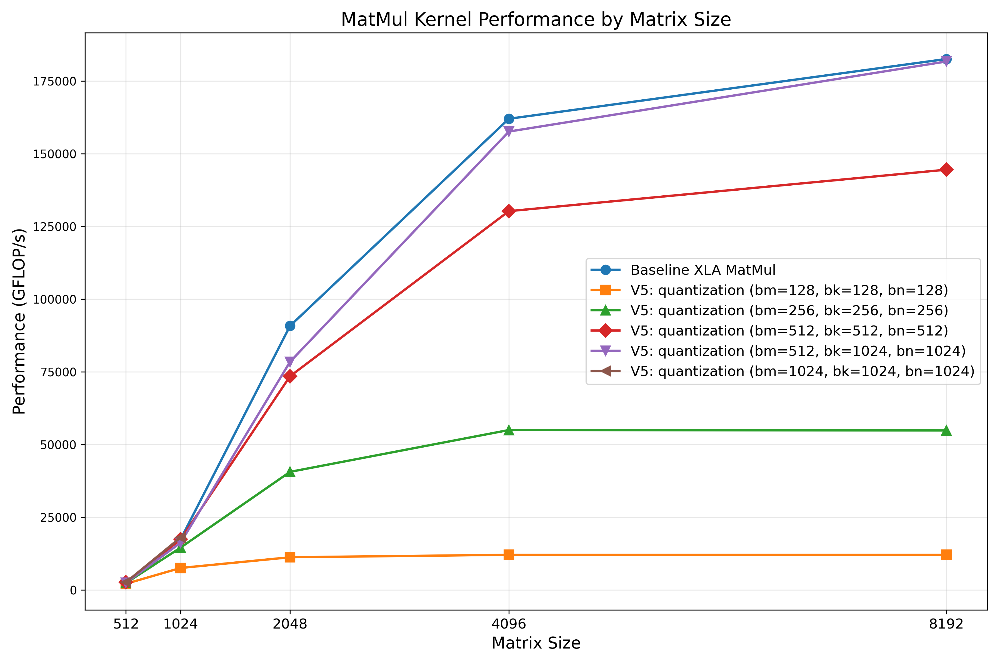

# PALLAS TPU MatMul Kernels

This repository demonstrates various matrix multiplication kernel implementations for TPUs using JAX's Pallas framework. The kernels showcase different optimization strategies for matrix multiplication on TPU hardware.

## Overview

Matrix multiplication is a fundamental operation in many machine learning workloads. This repository explores different approaches to implementing and optimizing matrix multiplication kernels on TPUs using JAX's Pallas, a low-level programming model for accelerators.

## Set up a TPU machine

```bash
# Create a TPU VM on Google Cloud, and SSH into the instance.
$ ./create_tpu_then_ssh.sh

# Clone the repository
tpu_vm $ git clone https://github.com/sqtian/PALLAS_TPU_KERNEL_MATMUL.git
tpu_vm $ cd PALLAS_TPU_KERNEL_MATMUL

# Install dependencies
tpu_vm $ python -m pip install --upgrade pip
tpu_vm $ python -m pip install -r requirements.txt
tpu_vm $ python -m pip install -U "jax[tpu]>=0.4.16" -f https://storage.googleapis.com/jax-releases/libtpu_releases.html
```

## Run TPU Kernels
Run single kernels.

```bash
tpu_vm $ python src/kernels/matmul_v1.py 
tpu_vm $ python src/kernels/matmul_v2_parallel.py 
tpu_vm $ python src/kernels/matmul_v3_block.py 
tpu_vm $ python src/kernels/matmul_v4_optimal_block_size.py
tpu_vm $ python src/kernels/matmul_v5_quant_prec.py
```
The repository also includes scripts for benchmarking and visualizing the performance of different kernel implementations:
```bash
# Generate performance plots
tpu_vm $ python visualize_performance.py --analyze=5 --dtype="bfloat16"
```

## Performance and Kernel Implementations

This repository includes several MatMul kernel implementations, each showcasing different optimization techniques:

1. **V1: Naive MatMul**: A basic implementation without specific optimizations.
2. **V2: Parallel MatMul**: Splits matrices by rows/columns for parallel processing.
3. **V3: Block MatMul**: Implements block-based matrix multiplication using a 3D grid.
4. **V4: Optimal block size MatMul**: Uses larger block sizes to optimize memory access patterns. 
5. **V5: Quantization**: Utilizes BFloat16 or INT8 precision with float32 accumulation for better performance.

### Kernel 1: Naive MatMul
A basic implementation without specific optimizations.

```
def matmul_v1_kernel(a_ref, b_ref, o_ref):
  o_ref[...] = a_ref[...] @ b_ref[...]


@jax.jit
def run_matmul_v1(a: jax.Array, b: jax.Array):
  kernel = pl.pallas_call(
      matmul_v1_kernel,
      out_shape=jax.ShapeDtypeStruct((a.shape[0], b.shape[1]), a.dtype)
  )
  return kernel(a, b)
```

With `o_ref[...] = a_ref[...] @ b_ref[...]`, the input matrices [M, K], [K, N] are loaded into VMEM, and the output matrix [M, N] is stored in the VMEM. It resulted in a high memory usage. As shown in the figure below, it can only process `M=K=N <= 1024` sizes. For `[2048, 2048] @ [2048, 2048] = [2048, 2048]`, we got overflow error "Failed: RESOURCE_EXHAUSTED: Ran out of memory in memory space vmem...".



### Kernel 2: Splits matrices by rows/columns for parallel processing

To avoid holding all matrices in VMEM, we can split the input matrix A by rows, and split matrix B by columns.

```
def matmul_v2_parallel_kernel(a_ref, b_ref, o_ref):
  o_ref[...] = a_ref[...] @ b_ref[...]

@functools.partial(jax.jit, static_argnames=['N'])
def run_matmul_v2(a: jax.Array, b: jax.Array, N: int):
  kernel = pl.pallas_call(
      matmul_v2_parallel_kernel,
      grid=(N, N),
      in_specs=[
          pl.BlockSpec((a.shape[0] // N, a.shape[1]), lambda i, j: (i, 0)),
          pl.BlockSpec((b.shape[0], b.shape[1] // N), lambda i, j: (0, j)),
      ],
      out_specs=pl.BlockSpec(
        (a.shape[0] // N, b.shape[1] // N), lambda i, j: (i, j)),
      out_shape=jax.ShapeDtypeStruct((a.shape[0], b.shape[1]), a.dtype)
  )
  return kernel(a, b)
```

It improves the memory usage slightly. The figure below shows the results for `N=4` parallelism. We can calculate `M=K=N <= 2048` sizes now. However, we also find the performance is not as good as XLA library `jnp.matmul()`.



### Kernel 3: Implements block-based matrix multiplication using a 3D grid

Previously the input matrices of size [block, M] or [M, block] are still loaded into VMEM.
One straightforward thought is to implement block-based matmul using a 3D grid, rather than the row/column split.
We can define ['bm', 'bk', 'bn'] to split the input and output matrices.
In the kernel code, we need to initialize the `o_ref[...]` for each iteration of K.

```
def matmul_v3_block_kernel(a_ref, b_ref, o_ref):
  @pl.when(pl.program_id(2) == 0)
  def init():
    o_ref[...] = jnp.zeros_like(o_ref)
  # Accumulates the multiplication for this block.
  o_ref[...] += a_ref[...] @ b_ref[...]


@functools.partial(jax.jit, static_argnames=['bm', 'bk', 'bn'])
def run_matmul_v3(
    a: jax.Array,
    b: jax.Array,
    *,
    bm: int = 128,
    bk: int = 128,
        bn: int = 128):

  m, k = a.shape
  _, n = b.shape
  assert k == b.shape[0]

  run_kernel = pl.pallas_call(
      matmul_v3_block_kernel,
      grid=(m // bm, n // bn, k // bk),
      in_specs=[
          pl.BlockSpec((bm, bk), lambda i, j, k: (i, k)),
          pl.BlockSpec((bk, bn), lambda i, j, k: (k, j)),
      ],
      out_specs=pl.BlockSpec((bm, bn), lambda i, j, k: (i, j)),
      out_shape=jax.ShapeDtypeStruct((m, n), a.dtype),
  )
  return run_kernel(a, b)
```

The figure below shows the successful runs for all sizes, with relatively bad performance compared to XLA library `jnp.matmul()`.



### Kernel 4: Uses optimal block sizes to optimize memory access patterns

TPUs are different from GPUs. When writing CUDA kernels, users need to think about the accesses from the view of threads which happen in parallel to each other
However, **TPUs are actually a SIMD systolic array device, each kernel could be viewed as sequential execution.**

Thus, we may search for the optimal block sizes for the best performance, because the loaded LHS can be reused for adjacent calculations.

The figure below shows a search for the best block size. It can be found that `(bm, bk, bn) == (512, 512, 512)` gives the best FLOP/s for this setting.



### Kernel 5: Quantization

The optimal block sizes can change for different configs, including the precisions being used. The figure below shows the best performance for `dtype = BFLOAT16`, where `(bm, bk, bn) == (512, 1024, 1024)` almost achieves the performance of XLA library `jnp.matmul()`.




## Stop and Remove TPU Instance

Do not forget to stop and remove the TPU instance.
```bash
$ ./remove_tpu_vm.sh
```


## License

MIT

## Acknowledgements

This project is inspired by JAX's Pallas framework and builds upon the TPU programming model.
